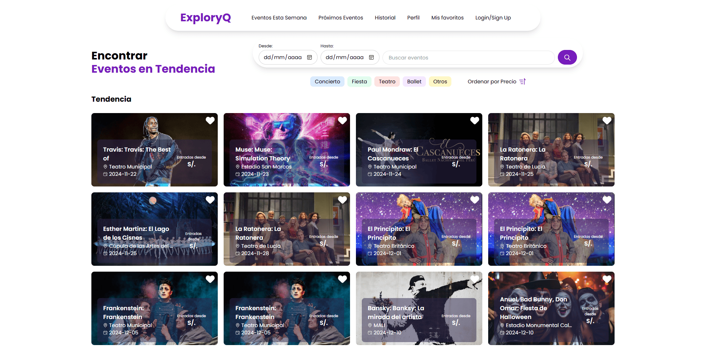
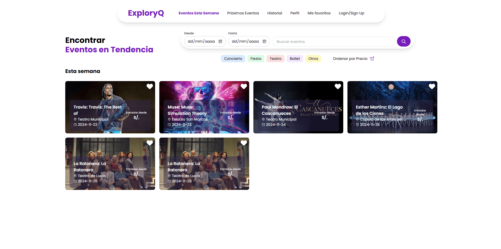
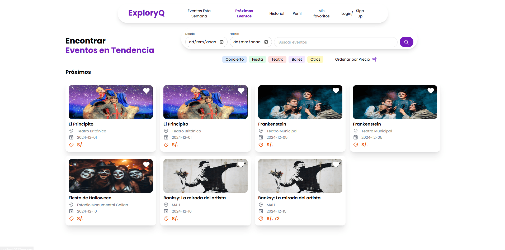
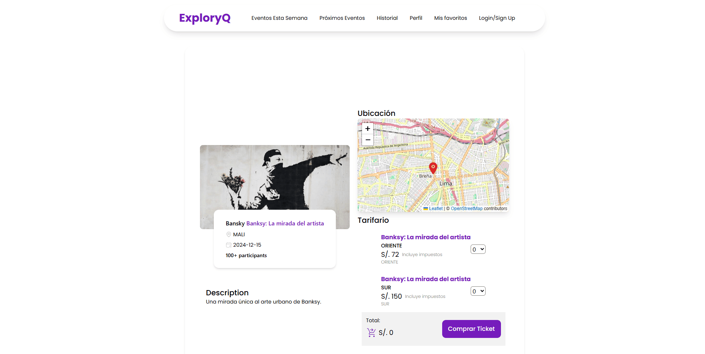
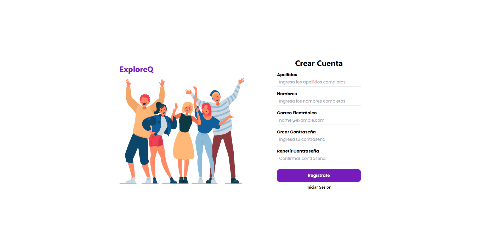

    

<h2 align="center">Frontend Repository</h2>

> Developed by [Sebastian Urdanegui](https://github.com/SebastianUrdaneguiBisalaya), [Leslie Zarate](https://github.com/LeslieZT), [Alexandra Rios](https://github.com/alexamibco) and [Ana Rivas](https://github.com/Cabrakana).

    
    
    
    

    <h2>Documentation</h2>

### Table of Contents

- [Table of Contents](#table-of-contents)
- [What is the Problem That Our Idea Solves?](#what-is-the-problem-that-our-idea-solves)
- [What Are the Perks of Our Idea?](#what-are-the-perks-of-our-idea)
- [How does the website work?](#how-does-the-website-work)
  - [Home](#home)
    - [Screen 1: Trending Events](#screen-1-trending-events)
    - [Screen 2: This Week Events](#screen-2-this-week-events)
    - [Screen 3: Upcoming Events](#screen-3-upcoming-events)
    - [Screen 4: Detail Events](#screen-4-detail-events)
  - [Auth](#auth)
    - [Screen 5: Create an account](#screen-5-create-an-account)
    - [Screen 6: Login](#screen-6-login)
  - [Features of the user](#features-of-the-user)
    - [Screen 7: Favorite Events](#screen-7-favorite-events)
    - [Screen 8: History Tickets](#screen-8-history-tickets)
    - [Screen 9: User Profile](#screen-9-user-profile)

### What is the Problem That Our Idea Solves?

> A lot of people around the world are suffering from the lack of access to information about events that are hapenning in their area. This is a problem that we want to solve with our idea.

### What Are the Perks of Our Idea?

We have developed a platform (website) that allows users to view different events occurring in their area.

> Users can navigate through three distinct event sections: **Trending Events**, **This Week Events** and **Upcoming Events**.

> Users can access detailed information about events, such as the date, time, location, description, and more.

> Various filters are available for users to refine their search, including date ranges, event name, event category, and sorting by minimum price.

> Users can register and create an account on the platform.

> Users can purchase event tickets through Stripe, which is integrated into the platform.

> Users can like or dislike events and view all liked events in a personalized section.

> Users who purchase tickets can view their ticket history for each event in a dedicated section.

### How does the website work?

#### Home

1. Users can browse through the three main event sections, apply various filters, and view detailed event information without logging in.

##### Screen 1: Trending Events

**Business Logic:** These events are sorted by popularity, with the most popular events appearing at the top. Popularity is measured based on the number of users who purchase tickets for the event. Additionally, the events are sorted by ascending event date. The price displayed for the event is derived from the minimum ticket price available.

##### Screen 2: This Week Events

**Business Logic:** These events are selected based on their dates, starting from today and extending up to seven (7) days from the current date. The events are sorted in ascending order by date.

##### Screen 3: Upcoming Events

**Business Logic:** These events are selected based on their dates, starting from seven (7) days after the current date. They are also sorted in ascending order by date.

##### Screen 4: Detail Events

#### Auth

2. If the user want to enjoy the more features of the website, he/shet must login. In the case the user does not have an account, he/she can create an account.

##### Screen 5: Create an account

##### Screen 6: Login

#### Features of the user

##### Screen 7: Favorite Events

##### Screen 8: History Tickets

##### Screen 9: User Profile

